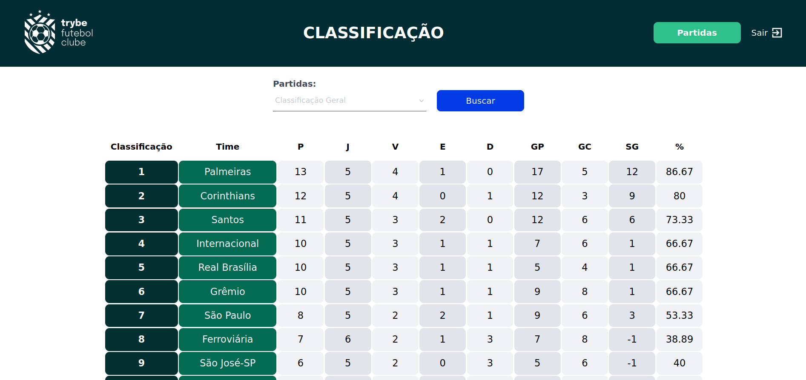

<h1>Sobre</h1>

Décimo projeto do módulo 3 - Back-end, da <a href="https://betrybe.com" target="_blank">Trybe!</a>

Dessa vez foi o projeto Trybe Futebol Clube. O desafio foi desenvolver uma API (utilizando o método TDD) para lidar com partidas em andamento ou finalizadas e, ao final, desenvolver uma tabela com a pontuação dos times. 

Para essa aplicação, utilizamos a Programação orientada a objetos (POO), bem como os princípios do SOLID.

obs: a aplicação frontend foi desenvolvida pela trybe.

<h1>Instalando</h1>

Para instalar, basta executar o comando <code>npm install</code> no diretório raiz do projeto.

Logo depois, rode o comando <code>docker-compose up</code>, também, no diretório raiz do projeto. 

<h1>Tecnologias utilizadas</h1>

<ul>
  <li>Node.js</li>
  <li>Express</li>
  <li>TypeScript</li>
  <li>Joi</li>
  <li>JWT</li>
  <li>Bcrypt</li>
  <li>Chai</li>
  <li>Sinon</li>
</ul>

<h1>Aplicação frontend consumindo os dados criados na API </h1>

<h1>Nota</h1>

 
